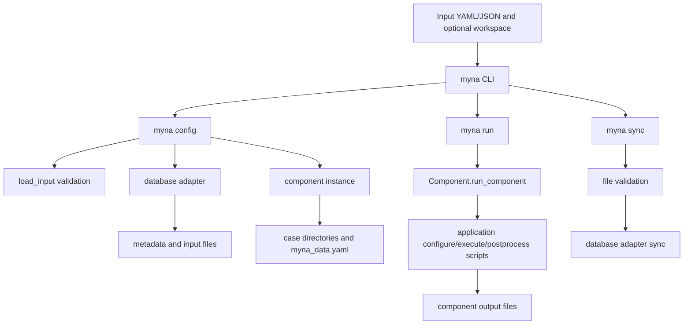

# Architecture

## Status

- Last verified: 2026-06-01 during the documentation-harness update
- Audience: maintainers, contributors, and coding agents
- Scope: describes current architecture; does not replace API docs or user docs

## System Purpose

Myna is a Python package for connecting additive-manufacturing build data with
multi-stage modeling and simulation workflows. It provides a structured interface
between build databases, workflow components, application wrappers, and output files so
users can configure, run, and sync simulation pipelines from Myna input files.

The main user workflows are:

- install Myna from a local checkout with `uv` or `pip`;
- write or copy a workflow input file from `examples/cases/`;
- run `myna config` to extract required metadata and create case directories;
- run `myna run` to execute configured application stages;
- run `myna sync` to push supported outputs back to a database;
- use `myna launch_peregrine` for Peregrine-oriented workflow launch inputs;
- import `myna` from Python for utility workflows, as shown under `examples/utils/`.

## Architectural Goals

- Keep workflow orchestration generic across build database formats.
- Represent workflow steps as components with explicit metadata, input, output, and
  hierarchy requirements.
- Isolate external simulation-tool behavior in application wrappers.
- Keep database-specific parsing and sync behavior behind database adapter classes.
- Preserve reproducible local environments through `pyproject.toml` and `uv.lock`.
- Make examples runnable while clearly marking optional Python packages and external
  applications.
- Keep generated case files, generated API docs, and local simulation outputs out of
  source control unless they are intentional fixtures.

## Repository Map

| Path | Purpose | Notes for agents |
| --- | --- | --- |
| `pyproject.toml` | Package metadata, dependencies, optional extras, CLI entrypoint, pytest markers | Source of truth for runtime Python version and dependency groups |
| `uv.lock` | Locked `uv` dependency graph | Commit updates when dependency declarations change |
| `src/myna/` | Python package source | Runtime code lives here |
| `src/myna/core/` | Workflow orchestration, components, file abstractions, metadata, app base helpers, utilities | Prefer generic workflow behavior here |
| `src/myna/core/workflow/` | `config`, `run`, `sync`, `status`, and input loading stages | CLI entrypoint delegates here |
| `src/myna/core/components/` | Workflow component classes and lookup table | Component string keys are user-facing compatibility surface |
| `src/myna/core/files/` | Output file classes and validation/sync value extraction | Add new output formats here |
| `src/myna/core/metadata/` | Build, part, layer, and file metadata requirements | Add new database-extracted requirements here |
| `src/myna/core/app/` | Shared application wrapper behavior | Use `MynaApp` for reusable app argument, template, process, MPI, and Docker behavior |
| `src/myna/database/` | Database readers/adapters and datatype lookup | Keep database-specific parsing and sync here |
| `src/myna/application/` | Wrappers/templates for external applications | Keep tool-specific configure/execute/postprocess logic here |
| `src/myna/cli/peregrine_launcher/` | Peregrine launch templates and default workspace | Used by `myna launch_peregrine` |
| `src/myna/mist_material_data/` | Packaged material JSON data | Package data used by application workflows |
| `tests/` | Pytest suite | Default test command excludes `apps` marker |
| `examples/cases/` | Runnable workflow cases | See `examples/cases/README.md` for dependency matrix |
| `examples/databases/` | Sample database fixtures | Some generated outputs under these trees are ignored |
| `examples/workspaces/` | Example workspace YAML files | Workspace files share app settings such as executables |
| `examples/utils/` | Standalone Python API examples | Not the same as runnable workflow cases |
| `docs/` | MkDocs source pages | Navigation controlled by `docs/.pages` |
| `docs/api-docs/` | Generated API docs from `scripts/group_docs.py` | Ignored by git; regenerate before docs builds |
| `docs/decisions/` | Lightweight architecture decision records | Add records for non-obvious architectural choices |
| `scripts/group_docs.py` | Generates and groups LazyDocs API documentation | CI runs this before `mkdocs build --strict` |
| `scripts/check_dev_tools.py` | Checks local development tool availability and writable caches | Run first in new agent or container shells |
| `scripts/check_docs_harness.py` | Validates required agent-harness docs and links | Runs in pre-commit and CI |
| `.pre-commit-config.yaml` | Local quality hooks | Includes Ruff, codespell, license headers, and docs harness check |
| `.github/workflows/CI.yml` | Package build, default tests, pylint, API docs, MkDocs, and external-app example CI | External-app job runs in a container |
| `.github/workflows/pre-commit.yml` | Pre-commit CI | Runs hooks on pull requests |
| `.github/workflows/doc-deployment.yml` | GitHub Pages deployment | Regenerates API docs and deploys MkDocs site on `main` |
| `CONTRIBUTING.md` | Contribution workflow, commit, PR title, and branch conventions | Follow for PR handoff |
| `README.md` | User-facing project overview and installation | Keep installation and high-level examples current |
| `AGENTS.md` | Agent entrypoint | Keep short; link to deeper docs |

## Runtime and Packaging Model

- Runtime language: Python `>=3.10`, from `pyproject.toml`.
- CI runtime: GitHub Actions package/test job currently uses Python `3.10`.
- Build backend: `setuptools.build_meta` with packages discovered under `src/`.
- Preferred dependency workflow: `uv sync --frozen` from the checked-in `uv.lock`.
- Development dependencies: `uv sync --frozen --extra dev`.
- Optional Python dependency groups:
  - `exaca`: `pyebsd`;
  - `bnpy`: `bnpy`, `opencv-python`, `POT`;
  - `cubit`: `netCDF4`;
  - `deer`: `netCDF4`.
- Runtime dependencies include Git-hosted packages, including `mistlib` from
  `ORNL-MDF/mist`.
- Console script: `myna = "myna.core.workflow.all:main"`.
- Generated files that should not be hand-edited as source:
  - `docs/api-docs/`, generated by `scripts/group_docs.py`;
  - local MkDocs `site/`;
  - workflow output folders such as `myna_resources/`, `myna_output/`, logs, and
    registered/simulation output folders listed in `.gitignore`.

On import, `src/myna/core/__init__.py` sets:

- `MYNA_INSTALL_PATH` to the installed `myna` package root;
- `MYNA_APP_PATH` to the installed `myna/application` directory.

Workflow commands set additional runtime environment variables, including `MYNA_INPUT`,
`MYNA_CONFIG_INPUT`, `MYNA_RUN_INPUT`, `MYNA_SYNC_INPUT`, `MYNA_STEP_NAME`,
`MYNA_STEP_CLASS`, and `MYNA_STEP_INDEX`. The `*_INPUT` variables are marked in code as
future deprecation targets; prefer `MYNA_INPUT` for new shared behavior.

## Main Concepts and Domain Model

- **Input file**: YAML or JSON workflow settings loaded by
  `myna.core.workflow.load_input`. Accepted suffixes are `.yaml`, `.json`,
  `.myna-workspace`, and `.myna-workspace-json`.
- **Workflow**: Ordered `steps` in an input file. The CLI can configure, run, and sync
  all steps or selected steps.
- **Step**: A named workflow entry with a component `class`, an `application`, optional
  app-stage arguments, optional executable, and optional input/output templates.
- **Component**: A subclass of `myna.core.components.Component` that declares
  `data_requirements`, `input_requirement`, `output_requirement`, and hierarchical
  `types` such as `build`, `build_region`, `part`, `region`, and `layer`.
- **Application wrapper**: Tool-specific code under `src/myna/application/<app>/<class>/`
  that may provide `configure.py`, `execute.py`, and `postprocess.py` stages. Wrappers
  commonly use `myna.core.app.MynaApp`.
- **Database adapter**: A subclass of `myna.core.db.Database` under
  `src/myna/database/` that loads metadata and syncs outputs for a supported data
  source.
- **Metadata**: Build, part, layer, or file requirements declared by components and
  fulfilled by database adapters through classes in `src/myna/core/metadata/`.
- **File abstraction**: Output file classes in `src/myna/core/files/` that validate
  files and optionally expose values for database sync.
- **Workspace**: Optional `.yaml` or `.myna-workspace` settings file referenced by
  `myna.workspace` in an input file. Workspaces share app settings such as executable
  paths across inputs.
- **Case directory**: Directory generated by `myna config` for a build/part/region/layer
  and step. Each case gets a `myna_data.yaml` subset of the configured input data.
- **Configure/run/sync stages**: The primary CLI flow. `config` extracts and writes
  required inputs, `run` delegates to app stages, and `sync` sends valid outputs through
  database adapter sync logic.

## Control Flow



The command dispatch starts in `myna.core.workflow.all.main`. For `config`, Myna loads
the input file, resolves the database adapter with `return_datatype_class`, extracts
component metadata requirements, creates case directories, writes per-case
`myna_data.yaml`, records expected output paths, and writes the configured input. For
`run`, Myna reloads the input before each step, applies step settings to a component,
sets step environment variables, and runs the available app-stage scripts. For `sync`,
Myna validates component outputs and delegates supported sync behavior to the selected
database adapter.

## Dependency Boundaries

Current intended boundaries:

- `src/myna/core/` owns generic abstractions and workflow orchestration.
- `src/myna/core/components/` should declare requirements and hierarchy, not embed
  external application execution details.
- `src/myna/core/files/` should validate Myna file formats and expose sync values, not
  parse database layouts.
- `src/myna/core/metadata/` should define metadata requirements and base loading
  behavior, not hard-code one database schema.
- `src/myna/database/` owns database-specific metadata loading, existence checks,
  segmentation type, and output sync.
- `src/myna/application/` owns external-tool wrappers, templates, executable handling,
  and postprocessing needed to satisfy component file contracts.
- `src/myna/cli/` contains launch templates and CLI-specific support; general workflow
  behavior belongs under `src/myna/core/workflow/`.
- `tests/` contains test-only helpers. Do not import from `tests/` in runtime modules.

Current mechanical enforcement is limited. There is no import-layer checker. Boundaries
are enforced by code organization, pytest coverage, Ruff, pylint in CI, docs, and
review. When changing subsystem dependencies, update this document and consider whether
tests or a lightweight check should enforce the new rule.

## Extension Points

| Extension | Put code here | Inspect first | Add or update | Validation |
| --- | --- | --- | --- | --- |
| New workflow component | `src/myna/core/components/` | `component.py`, a similar `component_*.py`, `component_class_lookup.py` | Component subclass, lookup key, tests, docs/example input if user-facing | `uv run pytest tests/test_component_output_paths.py` plus focused tests |
| New output file type | `src/myna/core/files/` | `file.py`, `file_vtk.py`, `file_temperature.py` | File subclass, `__init__.py`, component output requirement, sync value handling if needed | Focused file validation tests |
| New metadata requirement | `src/myna/core/metadata/` | `data.py`, `file.py`, existing `data_*` and `file_*` modules, `data_class_lookup.py` | Metadata class, lookup entry, database adapter load support, tests | Focused configure/database tests |
| New database reader | `src/myna/database/` | `database_types.py`, `myna_json.py`, `peregrine_hdf5.py`, `pelican.py` | Adapter subclass, lookup entry, example fixture/input if useful, database tests | `uv run pytest tests/test_database.py` and configure tests |
| New application wrapper | `src/myna/application/<app>/<component>/` | `src/myna/core/app/base.py`, a similar app wrapper, `docs/developer_guide.md` | `app.py` or stage scripts, templates, optional dependency docs, example case, tests | Unit tests by default; `apps`/`examples` tests only with tools available |
| New CLI command or mode | `src/myna/core/workflow/` or `src/myna/cli/` | `all.py`, `launch_from_peregrine.py`, `docs/cli.md` | Parser dispatch, tests, docs, launch template if applicable | Focused CLI tests and docs build |
| New example case | `examples/cases/` | `examples/cases/README.md`, similar case input | `input.yaml`, optional readme/template, dependency matrix row, tests if runnable in CI | `uv run pytest -m examples` only when dependencies exist |
| New docs page | `docs/` | `docs/.pages`, `docs/documentation.md`, `mkdocs.yml` | Page, navigation, supporting links | `uv run mkdocs build --strict` after generating API docs |
| New architecture decision | `docs/decisions/` | `docs/decisions/0000-template.md` | Numbered decision record and nav update if needed | Docs harness and docs build |

Preserve lookup keys in `component_class_lookup.py`, `data_class_lookup.py`, and
`database_types.py` unless a breaking change is intentional and documented.

## Testing and Validation Architecture

Pytest configuration lives in `pyproject.toml`. The default addopts are:

```bash
--import-mode=importlib -m "not apps"
```

Markers:

- `apps`: requires external application dependencies;
- `examples`: runs cases in `examples/`;
- `parallel`: example uses multiple cores.

Common validation commands:

| When | Command | Notes |
| --- | --- | --- |
| New shell preflight | `python3 scripts/check_dev_tools.py` | Verifies `uv`, writable caches, lock state, and dev tool entrypoints |
| Install dev tools | `uv sync --frozen --extra dev` | Uses `uv.lock`; add extras only as needed |
| Format | `uv run ruff format` | Same formatter as pre-commit |
| Lint | `uv run ruff check` | Pylint also runs in CI |
| Default tests | `uv run pytest` | Excludes `apps` tests |
| Focused tests | `uv run pytest tests/test_database.py` | Prefer targeted tests while iterating |
| External-app availability | `uv run pytest -m apps tests/test_executables.py` | Requires tools on `PATH` |
| External examples | `uv run pytest -m "examples and not parallel"` | Requires external tools and example fixtures |
| Generate API docs | `uv run scripts/group_docs.py` | Writes ignored `docs/api-docs/` |
| Build docs | `uv run mkdocs build --strict` | Run after API docs generation for parity with CI |
| Docs harness | `uv run python scripts/check_docs_harness.py` | Verifies agent-doc structure, links, and compactness |
| Pre-commit | `uv run pre-commit run --all-files` | May require network the first time hooks install |

CI behavior:

- `.github/workflows/CI.yml` installs with `uv sync --locked --extra dev`, runs default
  pytest, checks the docs harness, runs pylint with `--fail-under=7.25`, generates API
  docs, and builds MkDocs strictly.
- The `test-examples` CI job runs in `ghcr.io/ornl-mdf/containers/ubuntu:dev`,
  installs all extras, checks external executables, and runs example tests split by
  serial/parallel markers.
- `.github/workflows/pre-commit.yml` runs the pre-commit hooks on pull requests.

## Documentation Architecture

Documentation has three audiences:

- user-facing overview and install guidance in `README.md`, `docs/index.md`, and
  `docs/getting_started.md`;
- developer and extension guidance in `docs/developer_guide.md`, `docs/testing.md`,
  `docs/documentation.md`, and `docs/decisions/`;
- agent-facing orientation in `AGENTS.md` and this `ARCHITECTURE.md`.

The docs site uses MkDocs Material with `awesome-pages`, `awesome-nav`,
`gh-admonitions`, and `pymdownx.superfences`. Top-level docs navigation is in
`docs/.pages`. API docs are generated by `scripts/group_docs.py` using LazyDocs and are
ignored from git as `docs/api-docs/`.

Update docs when behavior changes:

- update `README.md` or `docs/getting_started.md` for installation, usage, or public CLI
  workflow changes;
- update `docs/developer_guide.md` for new extension patterns;
- update `docs/testing.md` for markers, CI changes, or new validation commands;
- update `docs/documentation.md` for docs tooling or harness changes;
- update `ARCHITECTURE.md` for subsystem boundaries, control flow, extension points, or
  significant dependency changes;
- add a decision record under `docs/decisions/` when a design choice will not be obvious
  from code review alone;
- keep `AGENTS.md` compact and link outward instead of copying long explanations.

## External Systems and Data

Required for the Python package:

- Python `>=3.10`;
- Python dependencies from `pyproject.toml` and `uv.lock`.

Optional or workflow-specific:

- 3DThesis, commit `646d461` or later, for Thesis application examples;
- AdditiveFOAM version `1.0` or later and OpenFOAM 10 for AdditiveFOAM/OpenFOAM
  application workflows;
- ExaCA version `1.3` or later for ExaCA workflows;
- Adamantine, Cubit, and DEER for their corresponding application wrappers/examples;
- Docker daemon when using `MynaApp` Docker execution options or the project container;
- sample databases under `examples/databases/` for local examples.

Never commit credentials, local executable paths, private data, or large generated
simulation outputs unless they are intentional fixtures. Prefer workspace files for
local executable configuration, and keep machine-specific values out of shared examples.

## Known Gaps

Known gaps and issues are tracked on the [Myna GitHub repository](https://github.com/ORNL-MDF/Myna/issues).
